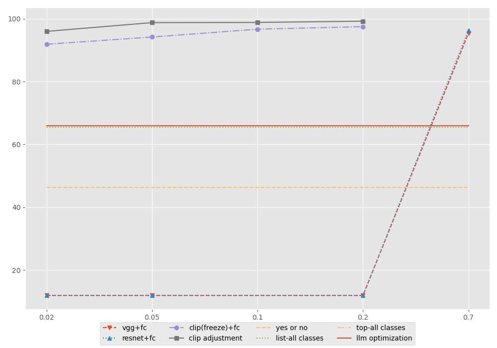
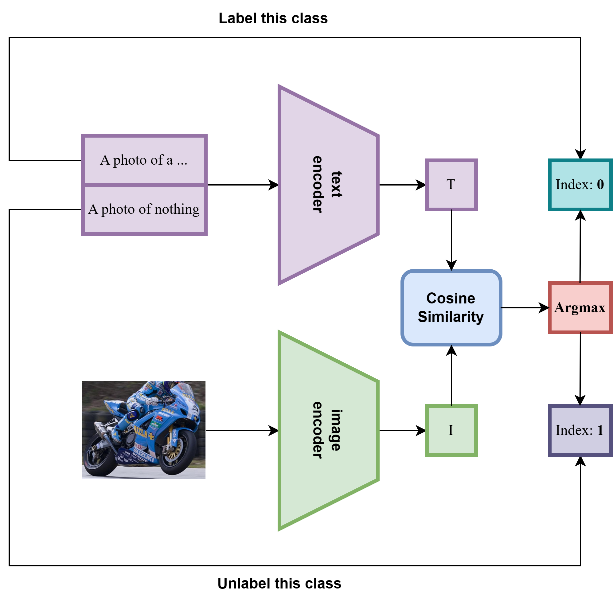
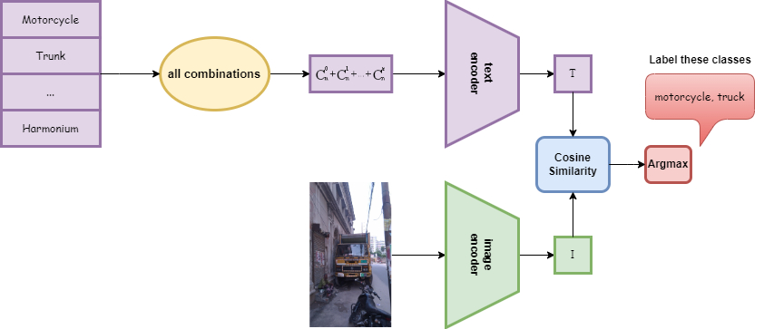
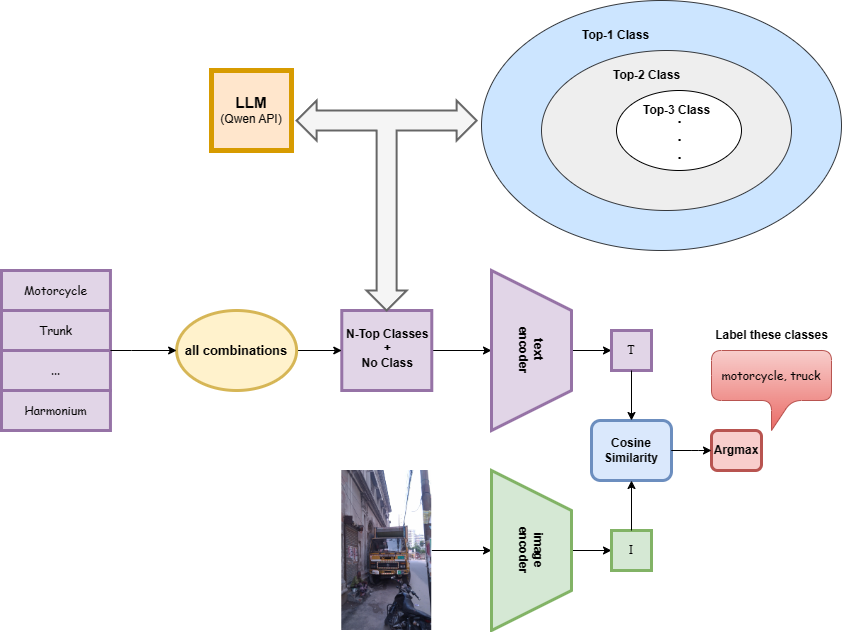
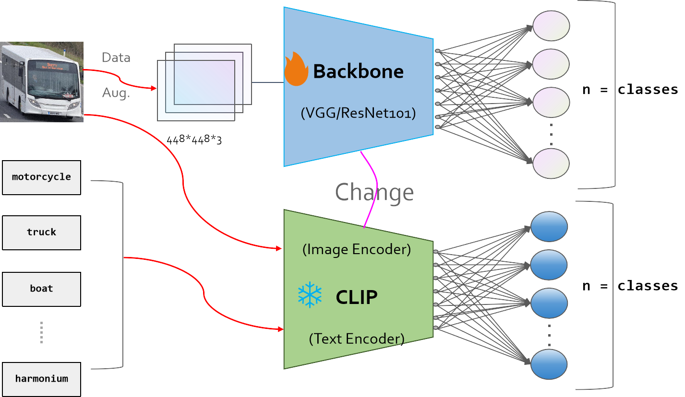
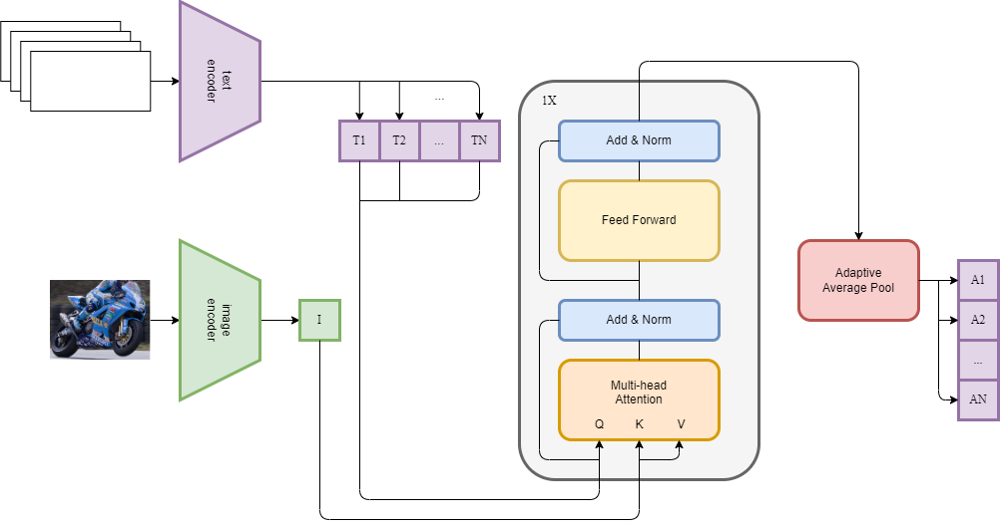

# MMM-CLIP: Multi-label-image-classification with Multi-method CLIP

Yitong Chen<sup>+1</sup>, Zhipeng Qiu<sup>+1</sup>, Xingsong Ye<sup>+1</sup><br>
<sup>1</sup>Shanghai Key Lab of Intelligent Information Processing, School of Computer Science, Fudan University.<br>
<sup>+</sup>Equally contributed & Co-Corresponding author.  
——Computer Vision Course (COMP130124.01) Project at Fudan University.

## Abstract
The concerns surrounding single-label image classification have been extensively explored, yet the multi-label image classification problem, often as an adjunct task of object detection, has not been fully studied separately. The conventional approach to solving this task involves using some pre-trained models as the backbone, followed by a fully connected layer to form the classification model, which is then trained on a large scale dataset. While this method is versatile, it is not well-suited for few-shot scenarios and fundamentally incapable of handling zero-shot situations. In our study, we present multiple novel universal multi-label image classification schemes based on the CLIP model including a text prompt-based scheme and a scheme involving modifications to the CLIP model by adding adapters. We have tested the effectiveness of these schemes on multiple datasets. In particular, our CLIP-MLD-Adapater Method has obtained SOTA outcomes in traditional learning, few-shot learning, and zero-shot learning.

## Introduction
Image classification has a long history in the Computer Vision (CV) field. After the ImageNet project and the introduction of AlexNet, the Convolutional Neural Network (CNN) proved to be a sufficient approach for CV tasks. However, the original AlexNet was introduced for the single-label image classification task. In the real world, it is very common for an image to contain multiple objects. Therefore, multi-label image classification is more realistic, which is the task that we are concerned with in our paper.

Unlike the old ImageNet period, nowadays we have multiple choices to solve this problem. The big success of Transformer in the Natural Language Processing (NLP) field proves the power of pre-trained models. For a long time, the CV field has known that pre-trained models' parts can serve as a feature extractor for downstream tasks. However, most models in the CV field are trained through supervised learning, which means they need a large amount of annotated data to train. Therefore, how to efficiently train a pre-trained CV model using images without annotations remains a big problem. By cutting images into patches served as image token embeddings, images can be considered as sequences and used for training a Vision Transformer (ViT). Therefore, nowadays the ViT is frequently used for image feature extraction and used in many downstream CV tasks. By adding some additional layer after the pre-trained ViT as a new model and fine-tuning it in a small dataset, it can achieve SOTA performance compared with other elaborately designed models.



In the field of multi-label image classification, due to issues such as uneven distribution and poor data quality in the target dataset, we hope to pre-train the model on a larger and richer dataset to learn some general knowledge, and then fine-tune in zero-shot or few-shot manner on the target dataset to prevent the model from being misled. Therefore, there are many powerful CV models which have strong zero-shot or few-shot capacity, especially CLIP. It is a model that both contains an image feature extractor and a text sequence feature extractor, which means it is a multimodal model. Since it is trained through the alignment of given text and image pairs, it can even do great performance in zero-shot situations. This kind of model is called Vision-Language Pre-training (VLP), they learn and sense the correspondence between the text and the image.

To utilize the CLIP in the multi-label image classification task, there are two main approaches. The first is to design proper prompts and it can even perform well in zero-shot. The second is to redesign the CLIP structure, such as simply adding a classification head. The latter is much more complex and cannot always ensure the redesigned structure can perform better than the original one.

It is easy to design a CLIP prompt for the single-label image classification, for example, a prompt like "A photo of *CLASS*." is sufficient. However, different prompt templates may influence the classification performance. If we try negative prompts like "A photo of no *CLASS*.", it may give us additional information about the image. Since the CLIP is trained with positive prompts, which means it may have a weak ability to process negative prompts. Therefore, researchers have pointed out that we need to train an additional negative text encoder to fit this requirement. In the meantime, the permanent prompt template may not be the best prompt to lead the right classification. With the Large Language Model (LLM) prompt optimization, these prompts can be polished and processed better to be fed into the text encoder in the CLIP, which may lead to a better classification result.

Another approach is to design a proper classification head for this task, which is called Adapter. Since the CLIP is trained by comparison, which means it has a strong ability to do the single-label image classification in zero-shot. To the best of our knowledge, earlier research proves that a well-designed classification head can lead to a better performance and the current SOTA model also uses a CLIP as a backbone. However, the classification head is elaborately designed for the multi-label image classification task and it's harder to replicate.

## Dataset and Contributions

Considering the multi-label image classification task, the dataset can be called Kaggle. It contains 7843 images, which are annotated with 10 classes. It can be solved directly by using the pre-trained model and method mentioned above in conventional learning. However, it is difficult to solve this problem in the few-shot even zero-shot situation, which is more concern and takes the main energy to solve for our group. Specifically, our contributions are as follows:

- We introduce multiple methods to prompt and fine-tune the CLIP, proving its powerful capabilities
- One of our methods work perfectly in few-shot scenarios, delivering SOTA performance with minimal training.
- The approaches that we introduce are transferable to other datasets.
- These adapters are simple in structure and can be quickly replicated and verified.

## Baseline
In the absence of a predefined benchmark score for evaluating our approach on the Kaggle dataset dedicated to the multi-label image classification task, we seek to establish a baseline performance using an existing methodology. To address this need, we turn to the work presented in the repository at hellowangqian's Github, which employs pre-trained visual models, specifically VGG and ResNet101, followed by a fully connected layer for multi-class classification tasks. Specifically, the model structure is illustrated below.

### Pre-Trained Model
The choice of pre-trained models is rooted in their ability to capture intricate features from large-scale image datasets. VGG and ResNet101, being well-established architecture, have demonstrated success in various computer vision tasks. Leveraging the pre-trained weights of these models allows us to benefit from the knowledge acquired during their training on extensive datasets, providing a robust starting point for our multi-label image classification task.

### Fully Connected Layer
The fully connected layer is used to transform the extracted features from the pre-trained models into predictions for the specific classes present in the dataset. In the context of multi-label image classification, it's crucial for accommodating the simultaneous prediction of multiple labels associated with each input sample. The customized layer adjusts the output dimensions to align with the number of classes in datasets, enabling the model to capture the inherent features of the class labels.

## Multi-method CLIP
### Multi-method to Prompt CLIP

The inherent power of CLIP in handling a wide array of tasks is well-established. Inspired by *Prompt: the fourth paradigm in NLP*, we explore strategies to adapt our frozen CLIP model for downstream tasks with zero-shot. Our objective is to transform the task into a format that CLIP can seamlessly address, effectively converting it into a more tractable single-label problem. To achieve this, we attempted four methods: Yes or No, List-all Classes, List-all Classes and LLM Optimization. The first method can be regarded as a separate idea, while the subsequent ones should be viewed as incremental refinements building upon the second method, and their performance is shown at Table 1.


**(1) Yes or No**
In this method, we perform binary classification for each class of each image, determining whether it contains the target object. For "existence" state, we utilize the foundational CLIP template "A photo of a...". To mitigate CLIP's dependence on label content, the negative case, indicating "non-existence", is formulated as "A photo of nothing" instead of "A photo without a...". The cosine similarity results between these two label constructions and the image, obtained through the CLIP text and image encoders, are then assigned a corresponding label of 1 or 0 based on the similarity. For example in Figure 2, if we ask about the "Motorcycle" in this picture, it will select 0-index and mark the motorcycle label as 1; but for "Trunk", the negative is selected and the trunk label is marked as 0.


**(2) List-all Classes**
For every image, we exhaustively enumerate all possible multi-classification scenarios. The result is given by the sum of combinations:
\[
\sum_{k=0}^{n} \binom{n}{k} = 2^n
\]
The prompt content involves a simple combination of classes without using templates or embellishments. For the optimal results provided by CLIP, all labels corresponding to the identified combinations are marked as 1, others are labeled 0. See Figure 3 for details.


**(3) Top-all Classes**
Enumerating all possible combinations in the "List-all" approach becomes increasingly challenging as the number of categories grows exponentially. Even with the capability to handle Kaggle's 10-class dataset, when faced with the VOC-2007 dataset, issues of "CUDA out of memory" arise. The comparative results from CLIP not only provide information about the highest values but also incorporate ranking information derived from large-scale text-image pair pretraining, exhibiting a certain degree of accuracy. To address the complexity arising from the exhaustive enumeration in List-all, we propose the "Top-all" strategy. Initially, CLIP is employed to rank classes, forming a sequence of [Top-1, Top-2,...,Top-n]. The combination content is then transformed into combinations of Top-k and all preceding results, as explained in Figure 4. A common sense is that when a label exists, labels with higher probabilities are also likely to exist. Finally, by adding a "nothing" prompt to ensure label completeness, the complexity of the previous method is reduced to O(n + n + 1) = O(n).


**(4) LLM Optimization**
In this approach, we harness the capabilities of large language model (LLM) to optimize the classification prompts by receiving the response of quarying the Qwen-14B API with "Please caption an image that contains ...". Other details are the same as the above and see the change in Figure 5.


### Multi-method to Fine-tune CLIP

If we leave CLIP unadjusted and only change the prompt, there exist some problems. The response to a single-label image classification task is based on contrast, and it's possible for the predicted probabilities of the positive and negative labels to be closely aligned. Therefore, we contemplate modifying the architecture of CLIP by adding a learnable adapter to tailor it for our specific task.


**(1) FC-Adapter**
Following the baseline approach, we simply add a fully connected layer to the fused features after the image and text encoders to transform them into the required label information (See their difference in Figure 6). Specifically, the probability of each label appearing in the image. To ensure a probability distribution within the range of [0, 1], we applied a sigmoid activation function to impose constraints. This method, as compared to the baseline, achieved a remarkable 98.4% mAP on the Kaggle dataset (See more results at Table 2 and Table 3), demonstrating its efficacy in adapting the model without altering the original parameters.


**(2) MLD-Adapter**
Considering the strong correlation between the structure of FC Adapter and the number of categories in the target dataset, which greatly limits the Zero-shot and Few-shot capabilities of CLIP, inspired by [Ridnik et al., 2023](https://arxiv.org/abs/2301.01234), we replace the non-transferable classification header FC-layer with a transferable Multi-label decoder. Specifically, we simply remove the self-attention layer from the Transformer decoder structure, and input text embedding as query and image embedding as key and value into the cross-attention layer. We then average-pooling on the token dimension to obtain output logits, which are then activated by sigmoid function to obtain probability values of [0, 1]. The experimental results show that just one layer of MLD block is enough to achieve good results on the target dataset after pretraining. See more details in Figure 7.


## Experiments
### Setups

**Datasets.** We train and evaluate our model on three diverse multi-label image classification datasets: Kaggle [Kaggle Dataset], VOC-2007 [VOC Dataset], and MS-COCO [COCO Dataset]. The Kaggle dataset, sourced from the original task, has been selected with a curated set of 10 classes following human inspection In the zero-shot scenario, the entire dataset is utilized, while in the train-test split mode, 70% is allocated for training and 30% for testing. VOC-2007, a benchmark dataset with 20 classes, includes 5,011 images in the train-validation set and 4,952 images in the test set for evaluation. MS-COCO, a vast dataset with 80 classes, includes 82,081 training and 40,137 validation images. The information of the datasets above is listed in Table 1.

**Implementation Details.** In replicating the baseline, we reproduce the parameters from the official GitHub repository. For the Kaggle dataset, we align the parameter selection with VOC-2007, and the mAP results are recorded from the best-performing epoch. For the FC-Adapter, aiming to showcase its superiority, we employ the AdamW optimizer and conducted training for only 1 or 2 epochs. The learning rate is set to 0.001, and the most fundamental MSELoss is chosen for the loss function. For the MLD-Adapter, we use one decoder block with four-heads-cross-attention layer and 0.4 dropout feed-forward layer, and employ the AdamW optimizer as well with 180 epochs pre-training on MS-COCO. To investigate the few-shot capabilities of our Adapter, we conduct experiments on the Kaggle dataset with varying training set/test set splits: 2/98, 5/95, 10/90, and 20/80.

### Multi-label-classification Results

In this section, we conduct experiments to compare various methods proposed in this study against baselines, both internally and externally. Initially, we employ conventional training strategies, utilizing an ample amount of training data distributed across three specified datasets for training and testing. Subsequently, we extend our evaluation to scenarios where CLIP excels, namely in few-shot and zero-shot learning. Notably, the previously mentioned prompt engineering falls within the zero-shot category.

#### Conventional Learning

In Table 2, the two adapters we proposed in Kaggle and its similar size of VOC-2007 are better than Baselines' performance. Moreover, CLIP-MLD-Adapter tested in Kaggle dataset can be said to perform surprisingly well, only 0.2% mAP is a full score. Since CLIP-MLD-Adapter will be pre-trained directly on the MS-COCO dataset, it is not appropriate to compare for fairness consideration. And for CLIP-FC-Adapter, we only use a FC-layer, which does not perform well under such a large-scale dataset as MS-COCO.

#### Few-shot Learning

When it comes to the field of few-shot, we can see that the baselines completely crash in Table 3. But even using a train-test ratio of 2/98, the two adapters easily beat baseline's metrics using the ratio of 70/30. Specially using only a train-test ratio of 20/80, CLIP-MLD-Adapter can also reach more than 99% mAP. The above results show that the adapters we used have excellent performance on the few-shot task.

### Zero-shot Learning

Our four prompt-based methods show that CLIP has some multi-label image classification capability, and they are gradually improved. But there is still a gap compared to its performance on a single label. CLIP-MLD-Adapter is pre-trained on MS-COCO, so it will have zero-shot capability on Kaggle and VCO-2007, which is a significant performance improvement compared to the previous four methods. It is worth noting that there is not a significant difference in performance between VOC-2007 in few-shot and zero-shot scenarios. However, Kaggle exhibits a noticeable drop, which could be attributed to the distributional differences between Kaggle and MS-COCO.

In Table 4, the five methods are compared in multi-label zero-shot learning task (mAP in %) on various datasets.


## Conclusion
In this paper, we proposed multiple methods to make the CLIP model capable of multi-label image classification, which can be roughly divided into two approaches. The first approach is based on text prompt, while the second involves adding adapters to it. Additionally, we established a basic baseline for conventional learning comparison. In the context of few-shot and zero-shot scenarios, the baseline is clearly incapable of any classification. However, the text prompt-based approach can achieve a mAP of 60% under appropriate trick settings in zero-shot scenarios. In few-shot scenarios, our proposed methods can achieve up to 96% mAP with only 2% of the training set and even over 99% mAP with 20% of the training set. Simultaneously, our approaches have been tested on other datasets, consistently yielding SOTA results. Through our research, it's evident that CLIP stands out as a robust model, showcasing considerable strength in our applications. The introduction of the Adapter should be a pivotal element, demonstrating its paramount role in enhancing CLIP's adaptability and performance across diverse tasks.

## Reference


## Citation
```
@article{mmm-clip202401,
 title={MMM-CLIP: Multi-label-image-classification with Multi-method CLIP},
 author={Chen, Yitong and Qiu, Zhipeng and Wang, Siyin and Ye, Xingsong},
 course={Computer Vision Course (COMP130124.01) , School of Computer Science, Fudan University},
 year={2024}
}

```

# About code

### Installation 

### Model

### Datasets

### Run


